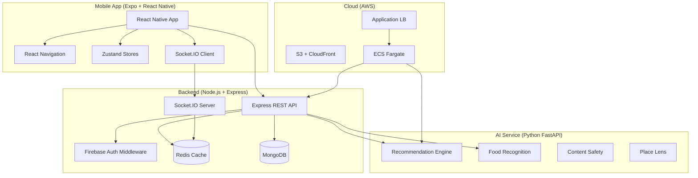

# CeylonTourMate — Full System Implementation Plan

## Overview

CeylonTourMate is a smart React Native (Expo) mobile app for tourists in Sri Lanka with 4 core AI-powered modules, real-time tracking, role-based access, and cloud deployment. The workspace at `d:\Y4S1\IT4010 - Research Project\CeylonTourMate` is currently empty — this is a greenfield build.

> [!IMPORTANT]
> This is a **massive** project (~150+ files across 3 services). Implementation will be done in **6 sequential phases**, each building on the prior. Each phase produces a working, testable increment.

---

## Architecture Overview

---

## User Review Required

> [!WARNING]
> **Scope & Time**: This plan covers ~150+ production files. Full implementation will take significant time. I recommend we build **Phase 1 (Scaffold) + Phase 2 (Module 1)** first, verify they work, then continue.

> [!IMPORTANT]
> **API Keys Required**: The following external services need API keys before those features work:
> - Firebase project (Auth + FCM)
> - Google Maps SDK key
> - OpenWeatherMap API key
> - AWS credentials (S3, ECS)
> - MongoDB connection string (Atlas or local)
>
> I'll use placeholder `.env` variables — you'll fill in real keys later.

> [!CAUTION]
> **AI Models**: Modules 3 & 4 (Food Recognition, Place Lens) require trained ML models. I'll write the full training pipeline and inference code, but the actual model files (`.h5`/SavedModel) won't exist until you train them on real datasets. I'll include mock/demo modes for development.

---

## Phase 1: System Architecture & Project Setup

### 1A — Mobile App Scaffold (Expo + TypeScript)

#### [NEW] `mobile/` — Expo React Native App

Created via `npx create-expo-app@latest ./mobile --template blank-typescript`

#### [NEW] [package.json](file:///d:/Y4S1/IT4010%20-%20Research%20Project/CeylonTourMate/mobile/package.json)
Dependencies to install:
- `expo`, `react-native`, `typescript`
- `@react-navigation/native`, `@react-navigation/stack`, `@react-navigation/bottom-tabs`
- `zustand` (state management)
- `axios`, `socket.io-client`
- `react-native-maps`, `expo-camera`, `expo-location`
- `expo-notifications`, `react-native-reanimated`
- `@gorhom/bottom-sheet`, `react-native-gesture-handler`
- `react-native-safe-area-context`, `react-native-screens`
- `expo-secure-store`, `expo-image-picker`

#### [NEW] [App.tsx](file:///d:/Y4S1/IT4010%20-%20Research%20Project/CeylonTourMate/mobile/App.tsx)
- `NavigationContainer` with auth flow detection
- Stack navigator wrapping: `AuthStack` (Login/Register/Onboarding) + `MainTabs`
- 5 bottom tabs: **Home, Tours, Live, Scan, Places**
- Role-based tab filtering (Tourist vs Guide vs Driver vs Admin)

#### [NEW] `mobile/src/navigation/`
- `AppNavigator.tsx` — root stack with auth check
- `AuthNavigator.tsx` — Login → Register → Onboarding flow
- `MainTabNavigator.tsx` — bottom tabs with role gating
- `TouristTabs.tsx` — Home, Tours, Live, Scan, Places, Profile
- `GuideTabs.tsx` — Dashboard, ActiveTrips, Alerts, Tourists, Profile
- `DriverTabs.tsx` — MyTrip, Navigation, Alerts, Profile
- `AdminTabs.tsx` — Analytics, Packages, Drivers, Guides, Reports

#### [NEW] `mobile/src/store/`
- `authStore.ts` — `{ user, token, role, isAuthenticated, login(), logout(), refreshToken() }`
- `tripStore.ts` — `{ activeTour, progress, alerts[], addAlert(), clearAlerts() }`
- `locationStore.ts` — `{ currentLocation, vehicleLocation, updateLocation() }`
- `uiStore.ts` — `{ loading, notifications[], setLoading(), addNotification() }`
- `packagesStore.ts` — `{ packages[], filters, fetchRecommendations(), setFilter(), bookPackage() }`

#### [NEW] `mobile/src/services/`
- `api.ts` — Axios instance with base URL, JWT interceptor, token refresh, error handling
- `socket.ts` — Socket.IO connection manager with auto-reconnect, room management
- `auth.service.ts` — Firebase Auth wrapper (Google/Phone/Email sign-in)
- `notification.service.ts` — FCM push notification registration

#### [NEW] `mobile/src/theme/`
- `colors.ts` — Sri Lanka palette: deep green `#1A2E1A`, gold `#C9A84C`, teal `#1D9E75`, cream `#F5F0E8`, coral `#E85D4A`
- `typography.ts` — Font families, sizes, weights (using Outfit from Google Fonts)
- `spacing.ts` — 4px grid spacing scale
- `theme.ts` — Combined theme object

#### [NEW] `mobile/src/types/`
- `user.types.ts` — User, UserRole, UserProfile, HealthProfile interfaces
- `package.types.ts` — Package, Activity, Booking, Itinerary interfaces
- `trip.types.ts` — Trip, LocationPoint, Alert, SOSEvent interfaces
- `ai.types.ts` — FoodPrediction, ContentSafety, PlaceIdentification interfaces

#### [NEW] Placeholder screens
- `mobile/src/screens/auth/` — LoginScreen, RegisterScreen, OnboardingScreen, SplashScreen
- `mobile/src/screens/home/` — HomeScreen
- `mobile/src/screens/tours/` — ToursScreen
- `mobile/src/screens/live/` — LiveScreen
- `mobile/src/screens/scan/` — ScanScreen
- `mobile/src/screens/places/` — PlacesScreen
- `mobile/src/screens/profile/` — ProfileScreen

---

### 1B — Backend Scaffold (Node.js + Express + MongoDB)

#### [NEW] `backend/` — Node.js Express API

#### [NEW] [package.json](file:///d:/Y4S1/IT4010%20-%20Research%20Project/CeylonTourMate/backend/package.json)
- `express`, `typescript`, `mongoose`, `socket.io`
- `ioredis`, `@socket.io/redis-adapter`
- `firebase-admin`, `jsonwebtoken`
- `cors`, `helmet`, `morgan`, `dotenv`
- `express-rate-limit`, `express-validator`
- `aws-sdk` (S3), `multer`

#### [NEW] [server.ts](file:///d:/Y4S1/IT4010%20-%20Research%20Project/CeylonTourMate/backend/src/server.ts)
- Express app with middleware chain (cors, helmet, morgan, rate-limit)
- MongoDB connection via Mongoose
- Redis connection via ioredis
- Socket.IO server with Redis adapter
- Route mounting: `/api/auth`, `/api/packages`, `/api/trips`, `/api/users`

#### [NEW] `backend/src/config/`
- `database.ts` — MongoDB connection with retry logic
- `redis.ts` — Redis client singleton
- `firebase.ts` — Firebase Admin SDK init
- `environment.ts` — typed env vars with validation

#### [NEW] `backend/src/middleware/`
- `auth.middleware.ts` — `verifyToken`, `requireRole(...roles)`
- `error.middleware.ts` — global error handler
- `validation.middleware.ts` — express-validator wrapper
- `rateLimiter.middleware.ts` — rate limiting config

#### [NEW] `backend/src/models/`
- `User.model.ts`, `Package.model.ts`, `Trip.model.ts`
- `LocationHistory.model.ts`, `Alert.model.ts`, `SOSEvent.model.ts`
- `Booking.model.ts`, `WeatherCache.model.ts`

#### [NEW] `backend/src/routes/` — Route definitions
#### [NEW] `backend/src/controllers/` — Route handlers
#### [NEW] `backend/src/services/` — Business logic

---

### 1C — AI Service Scaffold (Python FastAPI)

#### [NEW] `ai-service/` — Python FastAPI

#### [NEW] [requirements.txt](file:///d:/Y4S1/IT4010%20-%20Research%20Project/CeylonTourMate/ai-service/requirements.txt)
- `fastapi`, `uvicorn`, `pydantic`
- `tensorflow`, `numpy`, `Pillow`
- `scikit-learn` (TF-IDF, cosine similarity)
- `paddleocr`, `transformers` (BERT)
- `openai-clip` or `clip-by-openai`
- `httpx` (async HTTP), `pymongo`
- `python-multipart` (file uploads)

#### [NEW] [main.py](file:///d:/Y4S1/IT4010%20-%20Research%20Project/CeylonTourMate/ai-service/app/main.py)
- FastAPI app with CORS, lifespan (model loading)
- Router mounting: `/ai/recommend`, `/ai/food-recognition`, `/ai/content-safety`, `/ai/identify-place`
- Swagger UI at `/docs`

#### [NEW] `ai-service/app/models/` — Pydantic schemas
#### [NEW] `ai-service/app/services/` — ML inference logic
#### [NEW] `ai-service/app/core/` — Config, logging

---

## Phase 2: Module 1 — Smart Recommendation System

### Frontend

#### [NEW] [PackagesScreen.tsx](file:///d:/Y4S1/IT4010%20-%20Research%20Project/CeylonTourMate/mobile/src/screens/tours/PackagesScreen.tsx)
- Animated header with personalized greeting
- Horizontal filter chips: All, Cultural, Nature, Adventure, Beach, Wildlife, Wellness
- AI Match Banner with shimmer animation
- Staggered card entrance animations (react-native-reanimated)
- Pull-to-refresh, skeleton loading, empty state

#### [NEW] `mobile/src/components/packages/`
- `PackageCard.tsx` — Hero gradient, duration badge, AI Match % badge (green >90%, yellow >75%), rating, price, expandable details with animated press scale
- `FilterChip.tsx` — Controlled selection with haptic feedback
- `AIMatchBanner.tsx` — Animated shimmer effect
- `PackageDetailSheet.tsx` — Bottom sheet (gorhom) with full itinerary
- `BookingConfirmModal.tsx` — Booking confirmation with animation

### Backend

#### [NEW] `backend/src/routes/packages.routes.ts`
- `GET /api/recommendations?userId=&lat=&lng=`
- `GET /api/packages?category=&minPrice=&maxPrice=`
- `POST /api/packages/:id/book`
- `GET /api/packages/:id/itinerary`

#### [NEW] `backend/src/controllers/packages.controller.ts`
#### [NEW] `backend/src/services/packages.service.ts`

### AI Service

#### [NEW] [recommendation.py](file:///d:/Y4S1/IT4010%20-%20Research%20Project/CeylonTourMate/ai-service/app/services/recommendation.py)
- Content-based filtering: TF-IDF + cosine similarity (user interests vs package categories)
- Health gate: filter packages with incompatible activities
- Weather score: OpenWeatherMap integration, boost outdoor on sunny / indoor on rainy
- Collaborative filtering: dummy matrix factorization for similar user profiles
- Final score = `0.4*interest + 0.3*weather + 0.2*collaborative + 0.1*rating`

#### [NEW] `ai-service/app/routers/recommendation.py`
- `POST /ai/recommend` — `{ userId, lat, lng }` → `[{ packageId, matchScore, matchReasons[] }]`

---

## Phase 3: Module 2 — Live Monitoring System (CORE)

### Frontend

#### [NEW] [LiveMonitorScreen.tsx](file:///d:/Y4S1/IT4010%20-%20Research%20Project/CeylonTourMate/mobile/src/screens/live/LiveMonitorScreen.tsx)
- MapView (55% height) with animated vehicle marker, planned vs actual route polylines
- Destination pin with pulsing animation
- Speed chip + ETA chip floating overlays
- Stats row: Progress %, Distance Remaining, Route Safety
- Alert feed (ScrollView) with color-coded cards (SAFE/WARNING/DANGER)
- SOS button: long-press 3s, progress ring animation, countdown modal

#### [NEW] `mobile/src/components/live/`
- `VehicleMarker.tsx` — Custom animated bus icon with smooth GPS interpolation
- `AlertCard.tsx` — RouteDeviation, SpeedAnomaly, HarshBraking, etc.
- `SOSButton.tsx` — Long-press activation with progress ring
- `StatsRow.tsx` — 3-card progress display
- `SpeedChip.tsx`, `ETAChip.tsx` — Floating map overlays

### Backend Real-time

#### [NEW] [monitoring.socket.ts](file:///d:/Y4S1/IT4010%20-%20Research%20Project/CeylonTourMate/backend/src/sockets/monitoring.socket.ts)
- Room management: `trip:{tripId}`, `driver:{driverId}`, `agency:{agencyId}`
- `driver:locationUpdate` → validate, Redis store (TTL 30s), batch persist to MongoDB, broadcast, trigger anomaly detection
- `tourist:sos` → broadcast to guide + agency, FCM push, log SOSEvent, acknowledge

#### [NEW] [safety.service.ts](file:///d:/Y4S1/IT4010%20-%20Research%20Project/CeylonTourMate/backend/src/services/safety.service.ts)
- Speed anomaly: >80km/h on local road → WARNING
- Route deviation: >500m from planned polyline → DANGER
- Unauthorized stop: <2km/h for >5min not at waypoint → WARNING
- Harsh braking: speed drops >30km/h in <3s → WARNING
- Geofence breach: outside Sri Lanka bounding box → DANGER

#### [NEW] `backend/src/models/Trip.model.ts`, `LocationHistory.model.ts`, `Alert.model.ts`, `SOSEvent.model.ts`

---

## Phase 4: Module 3 — Image AI (Food + Content Safety)

### AI Service — Food Recognition

#### [NEW] [food_recognition.py](file:///d:/Y4S1/IT4010%20-%20Research%20Project/CeylonTourMate/ai-service/app/services/food_recognition.py)
- MobileNetV3 fine-tuning pipeline on Sri Lankan food dataset (30+ classes)
- Preprocessing: resize 224×224, normalize, augment
- Top-3 predictions with confidence + FoodInfo mapping
- Allergen cross-reference with user health profile
- `POST /ai/food-recognition` → `{ topPredictions[], foodInfo, allergenAlerts[] }`

### AI Service — Content Safety

#### [NEW] [content_safety.py](file:///d:/Y4S1/IT4010%20-%20Research%20Project/CeylonTourMate/ai-service/app/services/content_safety.py)
- PaddleOCR text extraction → multilingual BERT hate speech classifier (Sinhala, Tamil, English)
- CLIP embeddings for visual content classification (violence, nudity, extremism, harassment)
- Safety score 0–100; <60 = HARMFUL (block), 60–75 = WARNING (blur), >75 = SAFE
- `POST /ai/content-safety` → `{ isSafe, safetyScore, categories[], extractedText, action }`

### Frontend

#### [NEW] [ImageRecognitionScreen.tsx](file:///d:/Y4S1/IT4010%20-%20Research%20Project/CeylonTourMate/mobile/src/screens/scan/ImageRecognitionScreen.tsx)
- Segmented control: "Food" | "Content Safety"
- Camera view (50% height) with animated viewfinder, scanning line, flash/flip
- Food mode: prediction card, confidence ring, allergen alert, nutrition estimate
- Content Safety mode: safety score indicator, category breakdown, OCR text, blur/block actions

#### [NEW] `mobile/src/components/scan/`
- `CameraView.tsx`, `FoodResultCard.tsx`, `AllergenAlert.tsx`
- `SafetyScoreIndicator.tsx`, `CategoryBreakdown.tsx`

#### [NEW] `mobile/src/hooks/`
- `useCamera.ts` — permissions, capture, base64 conversion
- `useImageRecognition.ts` — API calls, loading, result caching

---

## Phase 5: Module 4 — Place Lens

### AI Service

#### [NEW] [place_recognition.py](file:///d:/Y4S1/IT4010%20-%20Research%20Project/CeylonTourMate/ai-service/app/services/place_recognition.py)
- EfficientNetB4 fine-tuned on 200+ Sri Lankan locations/objects
- Multi-label classification (heritage, nature, wildlife, flora, artifacts)
- Confidence threshold: 0.65 primary, 0.40 secondary
- Google Vision API fallback if confidence < 0.65
- `POST /ai/identify-place`, `POST /ai/identify-object`
- `GET /ai/places/search?q=`, `GET /ai/places/nearby?lat=&lng=&radius=`

### Frontend

#### [NEW] [PlacesScreen.tsx](file:///d:/Y4S1/IT4010%20-%20Research%20Project/CeylonTourMate/mobile/src/screens/places/PlacesScreen.tsx)
- Discovery Feed: search bar, category filters, PlaceCard list, nearby horizontal scroll
- Camera Identify mode: FAB → full-screen camera → split view results
- PlaceInfoCard with tabs: Overview, History, Visitor Info, Fun Facts

#### [NEW] [PlaceDetailScreen.tsx](file:///d:/Y4S1/IT4010%20-%20Research%20Project/CeylonTourMate/mobile/src/screens/places/PlaceDetailScreen.tsx)
- Hero gradient, tabbed content: About, Photos, Map, Reviews
- "Start Navigation" → Google Maps/Waze
- "Add to Itinerary"

#### [NEW] `mobile/src/components/places/`
- `PlaceCard.tsx`, `PlaceInfoTabs.tsx`, `AudioGuidePlayer.tsx`, `NearbyPlacesList.tsx`

---

## Phase 6: Auth, Admin & Deployment

### Auth System

#### [NEW] Auth screens
- `SplashScreen.tsx` — auto-login, role-based redirect
- `OnboardingScreen.tsx` — 3-step (interests, health, dietary)
- `LoginScreen.tsx` — email/password + Google + Phone OTP
- `RegisterScreen.tsx` — name, email, password, role selection
- `ProfileSetupScreen.tsx` — interests, health, emergency contacts

#### [NEW] `backend/src/middleware/auth.middleware.ts`
- `verifyToken` — decode Firebase JWT, attach user
- `requireRole(...roles)` — RBAC middleware
- `rateLimiter` — 100 req/15min per IP

### Admin Dashboard (React Native Web compatible)

#### [NEW] `mobile/src/screens/admin/`
- `LiveTripsMapScreen.tsx` — all active trips on map
- `AlertsCenterScreen.tsx` — alert management
- `DriverManagementScreen.tsx` — CRUD drivers
- `PackageManagerScreen.tsx` — CRUD packages
- `ReportsScreen.tsx` — charts (trips, incidents, revenue)

### Deployment

#### [NEW] Docker configs
- `backend/Dockerfile` — multi-stage Node.js 18 Alpine
- `ai-service/Dockerfile` — Python 3.11 slim + ML deps
- `docker-compose.yml` — local dev (api + ai-service + mongodb + redis)

#### [NEW] CI/CD
- `.github/workflows/deploy.yml` — test → build → ECR → ECS on push to main
- `.github/workflows/pr-check.yml` — lint + unit tests on PR

#### [NEW] Mobile build
- `mobile/eas.json` — dev/staging/production EAS configs
- `mobile/app.config.js` — environment-specific API URLs

#### [NEW] Monitoring
- CloudWatch alarm configs
- Sentry SDK integration in React Native
- Health check endpoints in both services

---

## File Count Summary

| Layer | Estimated Files | Status |
|-------|----------------|--------|
| Mobile App (Expo) | ~65 files | New |
| Backend (Node.js) | ~40 files | New |
| AI Service (FastAPI) | ~25 files | New |
| Config & Deployment | ~15 files | New |
| **Total** | **~145 files** | **All New** |

---

## Proposed Execution Strategy

> [!IMPORTANT]
> I recommend building this in **iterative phases** rather than all at once:
>
> 1. **Phase 1** — Get the scaffolds running (all three services boot up successfully)
> 2. **Phase 2** — Module 1 (Recommendations) end-to-end
> 3. **Phase 3** — Module 2 (Live Monitoring) — the CORE module
> 4. **Phase 4** — Module 3 (Image AI)
> 5. **Phase 5** — Module 4 (Place Lens)
> 6. **Phase 6** — Auth polish, Admin, Deployment
>
> Each phase produces a testable, working increment. Should I proceed with all phases, or start with Phase 1 only?

---

## Verification Plan

### Automated Tests
- `npm run dev` on mobile app — verify it launches with all navigation working
- `npm run dev` on backend — verify Express + MongoDB + Redis connections
- `uvicorn` on AI service — verify FastAPI docs load at `/docs`
- TypeScript compilation: `npx tsc --noEmit` on both mobile and backend
- API endpoint tests via curl/Postman for each route

### Manual Verification
- Visual inspection of all screens on iOS/Android simulator
- Socket.IO real-time event testing between multiple clients
- AI inference testing with sample images (after models are trained)
- Role-based navigation verification (login as each role type)

---

## Open Questions

> [!IMPORTANT]
> 1. **Should I build all 6 phases now, or start with Phase 1 (scaffold) and iterate?** Building everything at once will produce ~145 files — it's a lot to review.
> 2. **Do you already have Firebase/Google Maps/MongoDB credentials?** I'll use `.env` placeholders either way.
> 3. **For AI models (food recognition, place lens)** — do you have training datasets, or should I include synthetic/demo data for development?
> 4. **Mapbox vs Google Maps** — your spec mentions both. Should I use Google Maps SDK only (simpler) or integrate both?
